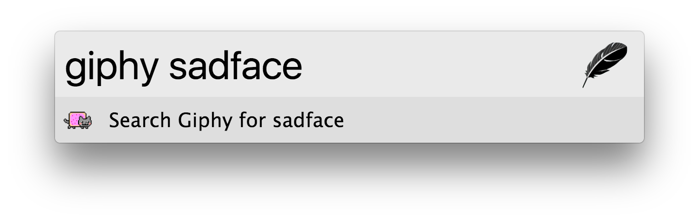

## Zazu Fallback

Creates some great fallback / web search functionality for Zazu.

## Usage

### Prefixed Searches

If you want to search a specific place like [npm](https://www.npmjs.com/),
[DuckDuckGo](https://duckduckgo.com/) or [Wikipedia](https://www.wikipedia.org/)
you can type that prefix directly into zazu and off you go!

Available searches can be found below.

### Root Searches

For commonly searched sites you would rather avoid typing in a prefix, because
that's more typing! I'm glad we're on the same page. If you use one or more of
these search enginges frequently you can turn on root level searches. If you
tell us which sites you use often, we'll display the results even without the
prefix!

For example if you tell us `npm` and `gh` are searched frequently and you type
`pryjs` into zazu, we'll give you a link to search both of those websites!

### URL Pasting

If you have a URL in your clipboard, or want to type one out, feel free to paste
it into Zazu and we'll give you an inline link. This is great if your browser
isn't open yet.

## Installing

Add the package to your plugins array in `./zazurc.json`.

~~~ json
"tinytacoteam/zazu-fallback"
~~~

You can also define custom searches:

~~~ json
{
  "name": "tinytacoteam/zazu-fallback",
  "variables": {
    "prefixSearches": {
      "library": {
        "icon": "fa-book",
        "name": "Library",
        "url": "https://multcolib.org/search/site/"
      }
    }
  }
}
~~~

To setup your prefered searches add a variable called `rootSearches`:

~~~ json
{
  "name": "tinytacoteam/zazu-fallback",
  "variables": {
    "rootSearches": ["google", "library"]
  }
}
~~~

## Searches

* `amazon`: [Amazon](https://www.amazon.com/)
* `duck`: [DuckDuckGo](https://duckduckgo.com/)
* `giphy`: [Giphy](https://giphy.com/)
* `gh`: [GitHub](https://github.com/)
* `google`: [Google](https://www.google.com/)
* `images`: [Google Images](https://www.google.com/)
* `maps`: [Google Maps](https://www.google.com/)
* `npm`: [NPM](https://www.npmjs.com/)
* `packagist`: [Packagist](https://packagist.org)
* `translate`: [Google Translate](https://translate.google.com/)
* `twitter`: [Twitter](https://twitter.com/)
* `stack`: [Stack Overflow](https://stackoverflow.com/)
* `ud`: [Urban Dictionary](https://www.urbandictionary.com/)
* `wiki`: [Wikipedia](https://wikipedia.org/)
* `wolf`: [Wolfram Alpha](https://www.wolframalpha.com/)
* `youtube`: [YouTube](https://www.youtube.com/)
* `thing`: [Thingiverse](https://www.thingiverse.com/)

## Screenshot

